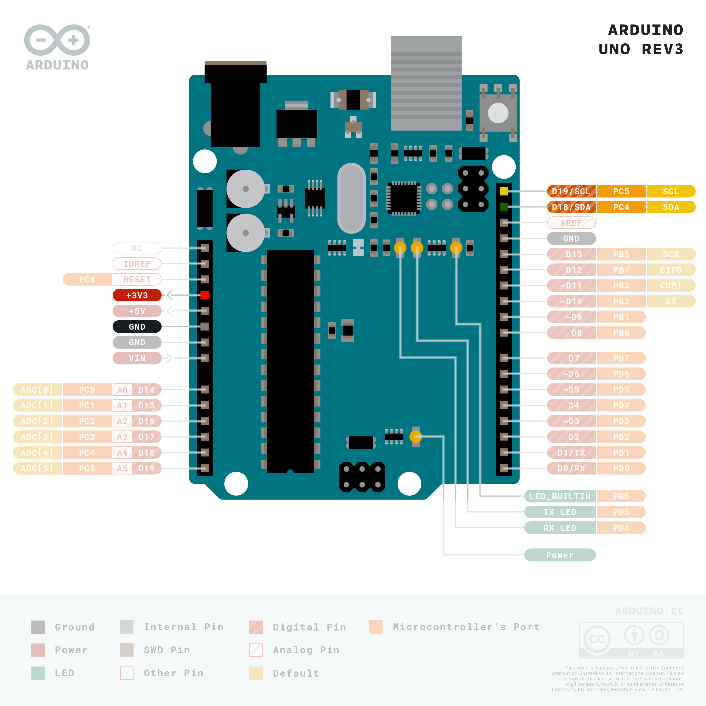

# I2c-Multiplexer Usage

This repository contains an arduino sketch that uses the I2c multiplexer
TCA9548A to control two instances of the Sensirion CO&#8322; sensor SCD4x.

## Using the Example

### Getting the Code

Follow these steps to get the software and build it:

- Clone the repository:
  ```
  git clone https://github.com/Sensirion/arduino-i2c-multiplexer-usage.git
  ```

- Install the arduino-cli tool if you don't have it already:
  Use a bash shell to execute the following command:
  ```
  export CLI_PATH=<your installation path for arduino-cli tool>
  curl -fsSL https://raw.githubusercontent.com/arduino/arduino-cli/master/install.sh | BINDIR=$CLI_PATH sh
  export PATH=$PATH:$CLI_PATH
  ```

- Build the example with the cli-tool:

  ```
  arduino-cli compile --profile arduino-uno ./multiplexerUsage
  ```

  This command will install all dependencies of the sketch and install them if
  not already available.

### Wire up the Setup

The example uses these components:

- Arduino Uno called MC:

  


- TCA9548A Multiplexer called MUX:

  


- two SCD41 Sensor called SCD41.1 and SCD41.2:

  


- four 10 kOhm resistors called R.1 - R.4 connected to the supply voltage.

The following table defines how you need to connect these components. The table uses the abbreviation MC for micro controller and MUX for the TCA9548A multiplexer. The sensors are named SCD41.1 respectively SCD41.2. For the resistors the
abbreviations R.1 to R.4 are used.

|Connection|FROM|TO|
|----------|----|--|
|Supply    |MC [+3V3]| MUX[VIN], SCD41.1[VDD], SCD41.2[VDD], R.1-R.4 |
|Ground    |MC [GND] | MUX[GND], SCD41.1[GND], SCD41.2[GND] |
|I2c-Master SCL|MC[SCL]| MUX[SCL]|
|I2c-Master SDA|MC[SDA]| MUX[SDA]|
|I2c-PORT-2 SCL| MUX[SC2]| SCD41.1[SCL]|
|I2c-PORT-2 SDA| MUX[SD2]| SCD41.1[SDA]|
|PULL-PORT-2 SCL| MUX[SC2]| R.1|
|PULL-PORT-2 SDA| MUX[SD2]| R.2|
|I2c-PORT-4 SCL| MUX[SC4]| SCD41.2[SCL]|
|I2c-PORT-4 SDA| MUX[SD4]| SCD41.2[SDA]|
|PULL-PORT-4 SCL| MUX[SC4]| R.3|
|PULL-PORT-4 SDA| MUX[SD4]| R.4|

Schematically the setup looks like this -
  <center>
  </center>

and like this in reality:

  <center>
  </center>

### Running the Example

After completion of the above steps you just can open the sketch
multiplexerUsage.ino with the Arduino IDE and load it to the connected Arduino-Uno board.

When opening the serial monitor with a rate of 115200 baud you should get an
output that is similar to this:
```
11:33:02.974 -> Selecting port nr 2
11:33:02.974 -> Port selection successful
11:33:03.488 -> Sensor serial-number: 0xD381BF073B5B
11:33:03.489 -> Selecting port nr 4
11:33:03.489 -> Port selection successful
11:33:03.987 -> Sensor serial-number: 0x17C79F073BAC
11:33:03.987 -> Waiting for first measurement... (5 sec)
11:33:09.183 -> Selecting port nr 2
11:33:09.183 -> Port selection successful
11:33:09.183 -> Port: 2	Co2: 1199	Temperature: 26.81	Humidity: 37.01
11:33:09.183 -> Selecting port nr 4
11:33:09.183 -> Port selection successful
11:33:09.228 -> Port: 4	Co2: 1365	Temperature: 26.73	Humidity: 38.29
11:33:09.414 -> Selecting port nr 2
11:33:09.414 -> Port selection successful
11:33:12.682 -> Port: 2	Co2: 1186	Temperature: 26.44	Humidity: 37.61
11:33:12.682 -> Selecting port nr 4
11:33:12.682 -> Port selection successful
11:33:12.682 -> Port: 4	Co2: 1397	Temperature: 26.44	Humidity: 38.80
11:33:12.857 -> Selecting port nr 2
11:33:12.899 -> Port selection successful
```

Obviously the serial numbers will be different!
